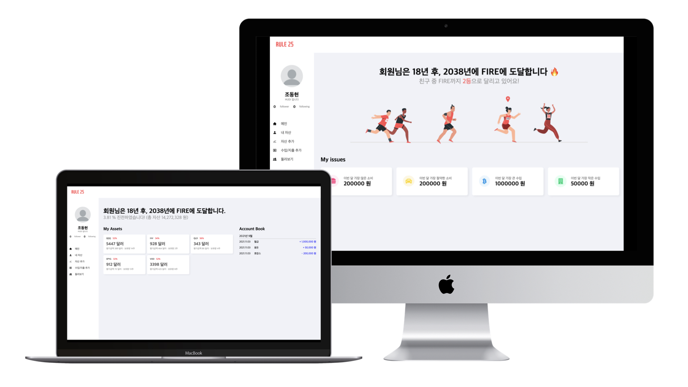

<h1 align="center">
RULE 25 🔥 - Frontend
</h1>

<p align="center">
본 프로젝트는 멋쟁이 사자처럼 9기 연합해커톤 '어흥 올림픽' 에서 1위를 차지하였습니다 🥇
</h1>



RULE 25 는 빠른 FIRE (Financial Independence, Retire Early) 달성을 위한 자산 관리 서비스입니다. 주식/암호화폐 자산을 등록하고, 가계부를 작성하여 FIRE 까지의 도달율과 예상 달성 기간을 확인할 수 있습니다.

[백엔드 레포지토리 바로가기](https://github.com/aheung-olympic-team-10/rule-25-backend)

## Develop Period

(기획/디자인 포함) 2021. 09. 23 ~ 2021. 09. 25

## Tech Stacks

- React
  - react-router-dom
  - styled-components
  - lodash
- Netlify

## Getting Started

### Yarn 설치

Yarn 이 설치되지 않은 환경에서는 아래 명령을 통해 설치합니다.

```
npm install -g yarn
```

### 의존성 설치

아래 명령을 통해 의존성 패키지를 설치합니다.

```
yarn
```

### 개발 서버 시작

아래 명령을 통해 개발 서버를 실행합니다. 개발 서버는 `localhost:3000` 으로 접속할 수 있습니다.

```
yarn start
```

## Contributors

> 10조는 인하대학교, 숭실대학교, 홍익대학교 학생으로 구성되어 있습니다.

<table>
   <tr>
      <td align="center"><a href="https://github.com/devHudi"><br /><sub><b>devHudi<br/>(Donghyun Cho)</b></sub></a></td>
      <td align="center"><a href="https://github.com/jiae0119"><br /><sub><b>jiae0119<br/>(JiAe Shin)</b></sub></a></td>
      <td align="center"><a href="https://github.com/yoo-jimin127"><br /><sub><b>yoo-jimin127<br/>(유지민)</b></sub></a></td>
      <td align="center"><a href="https://github.com/YooSeonHo"><br /><sub><b>YooSeonHo<br/>(YooSeonHo)</b></sub></a></td>
   </tr>
</table>
